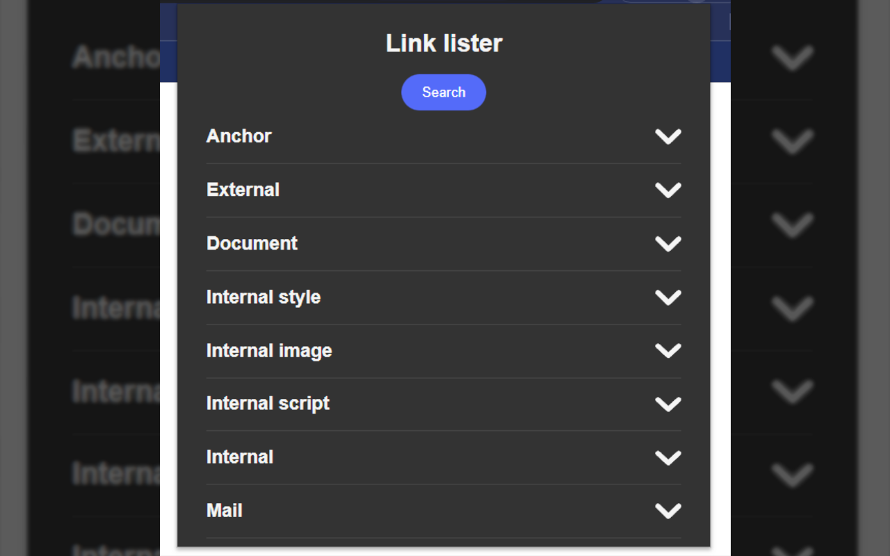
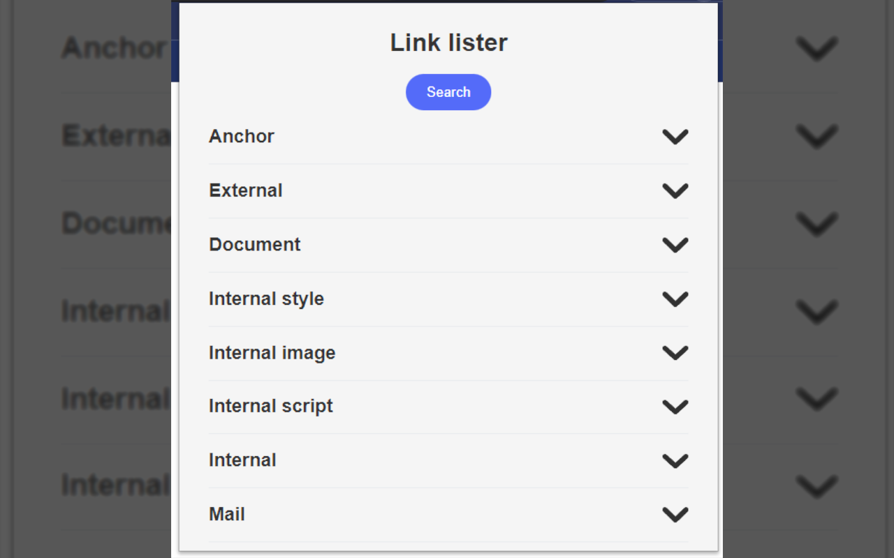
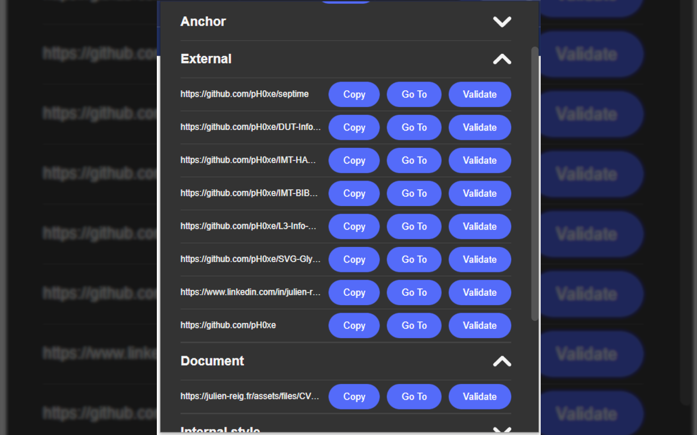

# Link Lister - Chrome Extension

Link Lister is a powerful Chrome extension that lets you quickly extract and organize all links on a web page. With Link Lister, you can:

- Easily extract all links from a web page with just a few clicks
- Organize links into categories to help you find what you need quickly
- Copy links to your clipboard with a single click
- Check the validity of links to ensure they work correctly
- Quickly navigate to links to save you time and hassle

# Screenshots

# Features:

- **Link Extraction**: Extract all links from a web page with just a few clicks.
- **Categorization**: Organize links into categories to help you find what you need quickly.
- **Copy Links**: Copy links to your clipboard with a single click.
- **Link Validation**: Check the validity of links to ensure they work correctly.
- **Quick Navigation**: Quickly navigate to links to save you time and hassle.
- **Dark Mode**: A dark mode is available to reduce eye strain and improve your browsing experience.

# Installation

To install Link Lister, follow these simple steps:

- Go to the Chrome Web Store and search for **"[Link Lister](https://chrome.google.com/webstore/detail/linklister/jiilmlblopaafeoackclollophidingd)"**
- Click on "Add to Chrome" to install the extension.
- Once installed, the extension icon will appear next to your address bar.

# Usage

Using Link Lister is simple and straightforward. Just follow these steps:

1. Install the extension.
2. Navigate to the web page that you want to extract links from.
3. Click on the Link Lister icon in the toolbar to open the popup.
4. The links will be automatically extracted and grouped by category in the popup.
5. Click on a category to expand it and view the links.
6. For each link, you can copy it to your clipboard, navigate to it, or check its validity using the provided buttons.

# Coming Soon

- **Export Links**: Export links to a file for easy sharing.
- **Filter Links**: Filter links by category, URL, or title.
- **Search Links**: Search links by inputting.

# Support

If you encounter any issues with **Link Lister** or have any suggestions for new features, please feel free to open an [issue](https://github.com/pH0xe/Link-Lister/issues) on our GitHub repository.

# License

This project is licensed under the terms of the [GNU General Public License version 3](https://opensource.org/license/gpl-3-0/)
